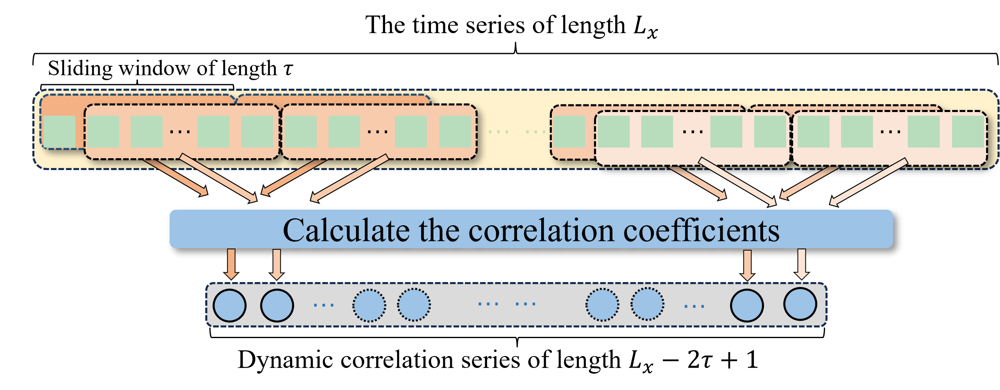

# CoDetect

A Novel Method for Detecting Change Points with Confidence Level in Time Series Analysis

## Abstract

This paper aims to enhance the understanding of structural breaks in time series, pinpoint the exact locations where these changes occur, and assign a confidence level to each detected point. 
We map various types of time series to generate a dynamic correlation series (DCS). This series not only retains the essential characteristics of the original time series but also abstracts away the original distribution, making it suitable for diverse types of time series analysis.
By providing a mathematical description of DCS, we summarize the Correlation-based Sliding Window Change Points Detection (CoDetect) method, which identifies change points with annotated confidence levels. Experimental validation demonstrates that our method offers broader applicability, improved interpretability, and higher computational efficiency compared to traditional algorithms. 

## Main structure

The project uses Dynamic Correlation Analysis (DCA) to obtain the Dynamic Correlation Series (DCS), analyzes the coefficient of variation of the DCS to obtain DCV, and mathematically models the DCS to determine the detection thresholds and confidence levels for CoDetect. 



### DCV

The function to measure DCV is in **NonStationarity.py**.

And the data of dataset is in "./PreModel/results/*". 


### CoDetect

The function is defined in **CoDetect.py**. 


## Synthetic Datasets

Run 

```cmd
python CraftedData.py --length 1000 --peroid 16
```

to creat the synthetic datasets with the length of 1000 and the peroid of 16. 


## Real-world Datasets

To test the relationship between Non-staionarity and prediction accuracy. 

#### Electricity Transformer Temperature

[Electricity Transformer Temperature (ETT)](https://github.com/zhouhaoyi/ETDataset) comprises two datasets at hourly level (ETTh) and two datasets at 15-minute intervals (ETTm). 
Each dataset includes seven oil and load features of electricity transformers spanning from July 2016 to July 2018. In this study, we selected to utilize ETTm2.

#### Exchange-rate

[Exchange-Rate dataset (Exchange)](https://github.com/laiguokun/multivariate-time-series-data) compiles the daily exchange rates of 8 countries spanning from 1990 to 2016. 

#### Household Electric Power Consumption

[The Household Electric Power Consumption dataset (Household)](https://doi.org/10.24432/C58K54) records the electricity consumption of households over a period of 4 years at a granularity of 1 minute. To simplify computations, this study performed sampling on the original dataset, adjusting the time granularity to ten minutes, to obtain the electricity consumption data. 

#### Solar Energy

[The Solar Energy dataset (Solar)](https://github.com/laiguokun/multivariate-time-series-data) contains records of solar power production throughout the year 2006, sampled every 5 minutes from 137 photovoltaic (PV) plants in Alabama State. 

#### SJTU daily step count

[The SJTU Daily step count dataset (SJTU)](https://doi.org/10.1186/s40537-024-00891-z) consists of minute-level step count data obtained from 686 users using the smartphone application SJTU Health for over 30 days. 
To simplify computations, this study performed sampling on the data, adjusting the time granularity to ten minutes. 

## The Relasionship MSE and DCV

run
```cmd
cd PreModel
```
to switch to the relevant path "./PreModel/"

And then run
```cmd
sh ./experiments/ett/experiments.sh
```
to start the prediction of dataset "ett"

The MSE results will be stored in "./PreModel/results/*"


